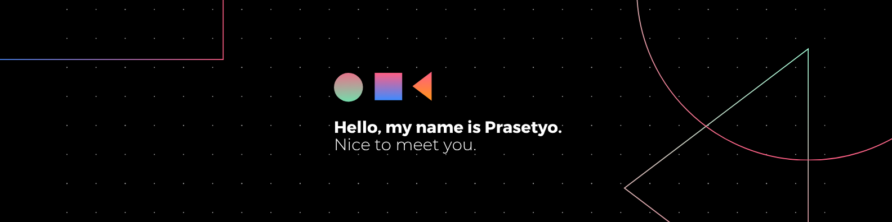

👋 Hello, I'm Eko Prasetyo

  

  <strong>Full-Stack Developer · AI & Automation · Data · Product & Business</strong>

  Building digital products that connect technology, data, and business processes.

  
  
  

---

🧑‍💻 About Me

I'm an Informatics Engineering undergraduate and a technology enthusiast focused on building practical digital solutions across software engineering, AI, data, and business automation.

My experience sits at the intersection of technology and business — from building full-stack applications to designing automation workflows, analyzing data, and exploring AI-powered solutions.

I'm particularly interested in:

- 🤖 AI & Generative AI
- ⚙️ Business Process Automation
- 📊 Data Analytics & Applied AI
- 💻 Full-Stack Web Development
- 🚀 Digital Product Development
- 💼 Product & Business Development

«My goal: turn technology, data, and automation into solutions that create measurable business value.»

---

🎯 Core Expertise

Full-Stack Development
        ↓
AI & Generative AI
        ↓
Data & Analytics
        ↓
Business Process Automation
        ↓
Digital Product Development

---

⚡ What I Build

Area| Focus
💻 Software Engineering| Full-stack web applications & scalable backend systems
🤖 AI Engineering| LLM, NLP, RAG, AI-powered applications & intelligent workflows
⚙️ Automation| Business process automation & workflow orchestration
📊 Data| Data analysis, visualization & business insights
🚀 Product| Product development, experimentation & digital transformation

---

🛠️ Tech Stack

💻 Languages

  
  
  
  
  
  
  

🧩 Frameworks & Libraries

  
  
  
  
  
  
  
  

🤖 AI / Data / Automation

  
  
  
  
  
  
  
  

🗄️ Database

  
  
  
  

📊 Analytics & Visualization

  
  
  
  

🔧 Tools & Platforms

  
  
  
  
  
  
  
  

---

📚 Currently Exploring

🤖 AI

- Generative AI
- LLM Applications
- RAG
- NLP
- AI Agents

⚙️ Automation

- n8n
- Workflow Automation
- Business Process Automation
- AI-powered Workflows

💻 Engineering

- Full-Stack Development
- Backend Architecture
- API Development
- Redis & Caching

📊 Data

- Data Analytics
- Applied AI
- Data Visualization
- Business Intelligence

---

🧠 My Approach

«"Technology should solve problems, not just demonstrate technology."»

I enjoy working across the full lifecycle of a digital solution:

Problem
   ↓
Research
   ↓
Product
   ↓
Engineering
   ↓
Data
   ↓
Automation
   ↓
Impact

This allows me to bridge the gap between technical implementation and business objectives.

---

📈 GitHub Activity

  
  

  

---

🤝 Let's Connect

I'm open to opportunities, collaborations, product ideas, and conversations around:

AI · Automation · Software Engineering · Data · Digital Product · Business Development

  
  

  <i>Building with code. Thinking with data. Automating for impact.</i>

